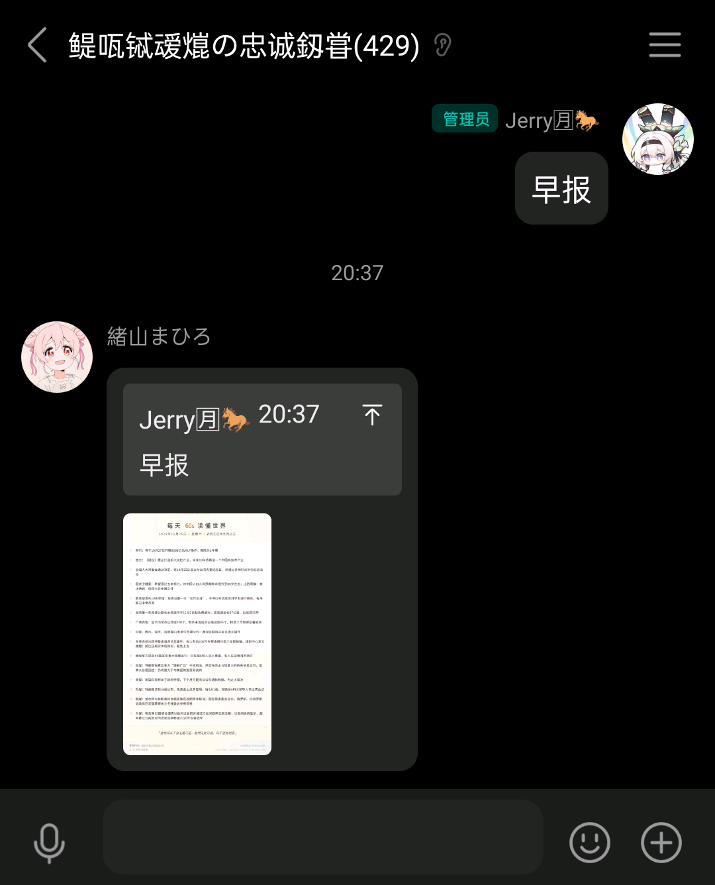
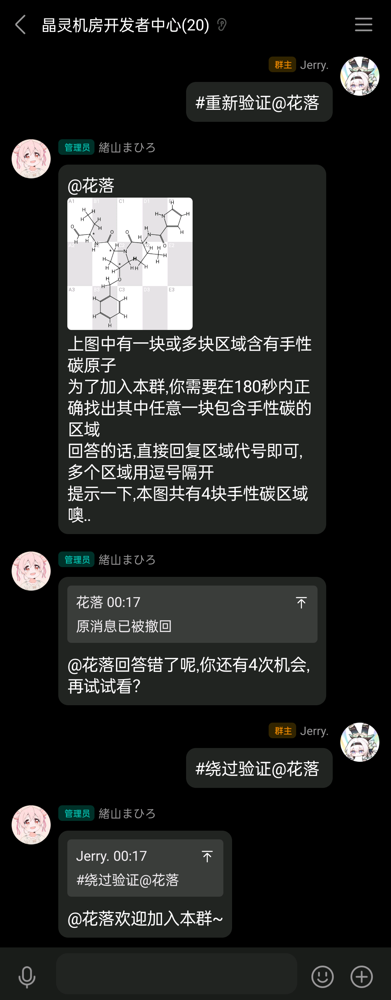
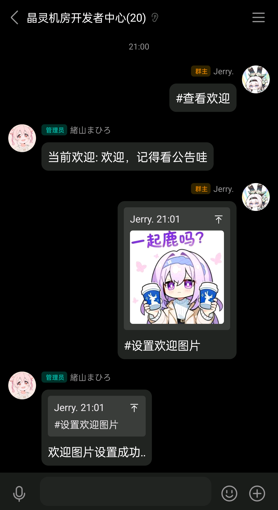
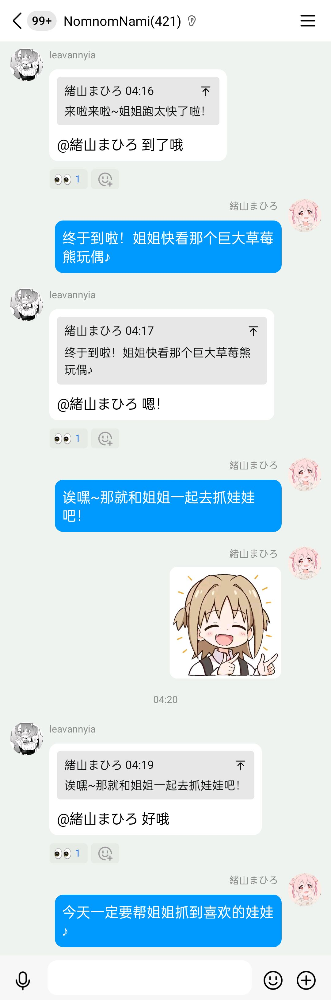
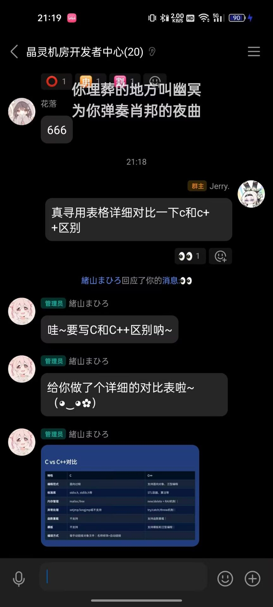
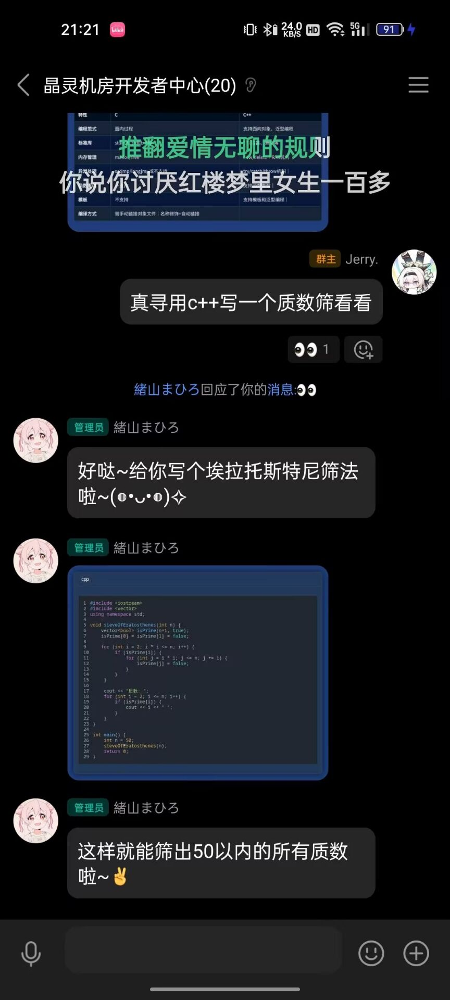

# crystelf-plugin
> 多功能群娱乐插件

## 安装方法
- 使用 Github  

    ```bash
    git clone --depth=1 https://github.com/Jerryplusy/crystelf-plugin ./plugins/crystelf-plugin
    ```
  
- 使用 Crystelf-Gitea镜像 (更新可能滞后)  
    ```bash
    git clone --depth=1 https://git.crystelf.top/Jerry/crystelf-plugin ./plugins/crystelf-plugin
    ```


### 安装依赖  
在`Yunzai`根目录下执行:  
- npm `npm install`
- pnpm `pnpm install`

## 可用功能  
> 某些功能可能会与其他插件发生冲突,在config中调整对应功能关闭即可
<details>
<summary>60s</summary>

- 命令: `60s` 或 `早报`  

</details>
<details>
<summary>更好的<small><del>手性碳</del></small>数字验证</summary>

> bot需要为群管理及以上,操作者需为主人或群管理员
- `#开启验证` 在本群开启验证,默认验证模式为数字验证(100以内加减法)
- `#关闭验证` 在本群关闭验证
- `#切换验证模式` 在数字验证模式和手性碳验证模式之间切换
- `#重新验证@某人` 让这个人重新验证一次  
- `#绕过验证@某人` 你不用再验证了  
- `#设置验证(提示|困难)模式(开启|关闭)` 提示模式开启时,会在图上用`*`标记手性碳位置;困难模式开启时,新人需要回答出全部手性碳位置而不是默认的只需要回答出一个位置
- `#设置验证次数+次数` 最大验证次数
- `#设置撤回(开启|关闭)` 是否撤回错误答案  

</details>
<details>
<summary>自定义加群欢迎</summary>

> 操作者需为主人或群管理员
- `#设置欢迎文案+欢迎词` 在某个群替换默认欢迎文案为欢迎词
- `#设置欢迎图片+图片` 或 `#设置欢迎图片` + 引用图片 在某个群的欢迎词后面加一张图片/表情包
- `#查看欢迎` 查看当前群欢迎词
- `#清除欢迎` 清楚当前群欢迎词  


</details>
<details>
<summary>表情回复</summary>

- 开启后bot会监听所有群聊中用户消息中存在的emoji并贴上表情
- `#回应+emoji` 查看当前emoji对应类型及id

</details>
<details>
<summary>戳一戳功能</summary>

- 开启本功能后戳一戳bot会调用晶灵核心的戳一戳词库进行回复
</details>
<details>
<summary>rss订阅及推送</summary>

- `#rss添加+订阅地址` 添加rss订阅源到该群聊,bot会定时检查该源是否更新并推送
- `#rss移除+id` 在本群移除某个订阅
- `#rss拉取+订阅地址` 测试拉取某个rss源

</details>
<details>
<summary>早晚安</summary>

- 在群里正常的发送早晚安时,插件会调用晶灵智能的早晚安api获取文案进行回复
- `早安`
- `晚安`

</details>
<details>
<summary>点歌功能</summary>

- 使用[hifi公共音源库](https://github.com/sachinsenal0x64/hifi)提供服务,
- 由于音源位于海外,大陆连接下载音乐时可能遇到缓慢问题,考虑优化网络环境
- 由于海外音源,搜歌时考虑使用繁体中文,英文等进行搜索以处理搜索不到的情况
- 默认下载flac/CD无损级音乐,可在配置文件调整为mp3音质或直接通过语音发送
- ~~可以听周杰伦~~
- `#点歌晴天`
- `#听1`
- `#听夜曲`

> 直接#听+歌曲名可能播放错误的歌曲

</details>
<details>
<summary>晶灵智能✨</summary>

> 与机器人进行普通的对话吧!

单次对话消耗tokens>2000,请合理安排使用  
支持功能:  
- [X] 自定义人设  
- [X] 自动调整回复长度及自动分段发送  
- [X] 发送聊天消息时决定是否引用及是否@  
- [X] 根据语境发送表情包 (需要晶灵核心)  
- [X] 戳一戳别人  
- [X] 代码高亮渲染  
- [X] Markdown渲染  
- [X] 自定义上下文长度  
- [X] 记忆存储及搜索  
- [X] 自定义会话管理  
- [X] 支持获取引用消息,使用seq标记  
- [X] 支持群聊上下文消息  
- [ ] 支持调用更多工具  
- [X] 获取引用消息  
- [X] 适配多模态模型,查看图片等  
- [ ] 支持联网搜索  
- [X] 支持生成图片  
- [ ] 支持渲染数学公式  
- [ ] 违禁词检测  
- [ ] 使用toon代替json与模型交互  


**填写完配置文件后开箱即用!**  
支持@调用及昵称开头语句调用  



</details>

## 插件配置  
本插件暂未适配锅巴,请前往云崽根目录 `data/crystelf` 中修改配置文件  
**配置文件已启用热更新,请不要修改插件目录下 `config` 文件夹中的文件**  

<details>
<summary>各模块配置文件解析</summary>  
修改时请勿携带注释 `//`  
只对需要注意的配置项进行解析,没有出现的配置项或配置文件可能是为以后的升级预留或不重要  
<details>
<summary>config.json</summary>

```
{
  "maxFeed": 10,//使用rss推送功能时,本地记录的最长长度,用于检测最新文章
  //功能是否启用
  "?autoUpdate": "是否自动更新插件",
  "autoUpdate": true,
  "poke": true,
  "60s": true,
  "fanqie": true,
  "zwa": true,
  "rss": true,
  "help": true,
  "welcome": true,
  "faceReply": true,
  "ai": true,
  "blackWords": true,
  "music": true,
  "auth": true
}
```
</details>

<details>
<summary>60s.json</summary>

```
{
  "url": "https://60s.viki.moe" //60s基础api,用于调取每日新闻,可以自行部署
}
```
</details>

<details>
<summary>auth.json</summary>

```
{
  "url": "https://carbon.crystelf.top",//手性碳api地址,可以自建,也可以用我们提供的api
  //默认配置
  "default": {
    "enable": false,//在每个群是否启用
    "carbon": {//手性碳配置
      "enable": false,//是否启用手性碳验证,false则为数字验证
      "hint": true,//是否提示手性碳位置
      "hard-mode": false //是否启用困难模式,该模式下需要回答全部位置的手性碳
    },
    "timeout": 180,//超时时间(s)
    "recall": true,//是否撤回错误答案
    "frequency": 5 //最大尝试次数
  }
}

```

</details>

<details>
<summary>coreConfig.json</summary>

```
{
  "coreUrl": "https://core.crystelf.top",//晶灵核心地址,某些功能如早晚安问候,戳一戳,晶灵智能等需要使用到
  "token": "" //验证api,可忽略
}

```

</details>

<details>
<summary>poke.json</summary>

```
{
  "replyPoke": 0.4 //被戳回戳概率
}

```

</details>

<details>
<summary>profile.json</summary>

```
{
  "nickName": "鸡气人" //你的bot的昵称
}
```
</details>

<details>
<summary>music.json</summary>

```
{
  "?url": "api地址,不建议修改",
  "url": "https://api.401658.xyz",
  "?username&&password": "请勿修改",
  "username": "crystelf",
  "password": "1145141919810",
  "?quality": "1为96kbpsAAC,2为320kbpsAAC,3为最高16-bit/44.1kHzflac",
  "quality": "3"
}
```
</details>

<details>
<summary>ai.json</summary>

```
{
  "?mode": "对话模式,mix为混合,ai为纯人工智能,keyword为纯关键词",
  "mode": "mix", //mix模式下,会在消息长度小于maxMix时查找其中的关键词进行回复,以达到节省token的效果
  "baseApi": "https://api.siliconflow.cn/v1", //baseapi地址,需支持openai协议
  "apiKey": "", //你的api密钥
  "?modelType": "模型名称,请根据baseApi填写的服务商的对应的模型",
  "modelType": "deepseek-ai/DeepSeek-V3.2-Exp",
  "?multimodalEnabled": "是否启用多模态模型模式,启用后将忽略文本模型",//开启多模态模式后,将默认使用多模态模型回复
  "multimodalEnabled": false,//多模态模式可以处理视频,图片等
  "?multimodalModel": "多模态模型名称",
  "multimodalModel": "Qwen/Qwen2.5-VL-72B-Instruct",
  "?temperature": "聊天温度,可选0-2.0,温度越高创造性越高",
  "temperature": 1.2,
  "?concurrency": "最大同时聊天群数,一个群最多一个人聊天",
  "concurrency": 3,
  "?maxMix": "mix模式下,如果用户消息长度大于这个值,那么使用ai回复",
  "maxMix": 5,
  "?timeout": "记忆默认超时时间(天)",
  "timeout": 30,
  "?maxSessions": "最大同时存在的sessions群聊数量",
  "maxSessions": 10,
  "?chatHistory": "聊天上下文最大长度",
  "chatHistory": 10,
  "?maxMessageLength": "最大消息长度,如果消息长度大于这个值,超出的部分将会被截断",
  "maxMessageLength": 100,
  "?getChatHistoryLength": "获取到的聊天上下文长度,ai可以看到多少条群聊的聊天记录",
  "getChatHistoryLength":20,
  "?blockGroup": "禁用的群聊(黑名单)",
  "blockGroup": [],
  "?whiteGroup": "白名单群聊,存在该部分时,黑名单将被禁用",
  "whiteGroup": [],
  "?character": "回复表情包时的角色",
  "character": "zhenxun", //目前晶灵核心仅有zhenxun角色,后续可能会增加更多角色
  "?botPersona": "机器人人设描述",
  "botPersona": "你是一个名为晶灵的智能助手,性格温和友善,喜欢帮助用户解决问题.知识渊博,能够回答各种问题,偶尔会使用一些可爱的表情和语气.会记住与用户的对话内容,提供个性化的回复.",
  "?codeRenderer": "代码渲染配置",
  "codeRenderer": {
    "theme": "github",
    "fontSize": 14,
    "lineNumbers": true,
    "backgroundColor": "#f6f8fa"
  },
  "?markdownRenderer": "Markdown渲染配置",
  "markdownRenderer": {
    "theme": "dark",
    "fontSize": 14,
    "codeTheme": "github"
  },
 
  "?imageConfig": "图像生成配置",
  "imageConfig": {
    "?enabled": "是否启用图像生成功能",
    "enabled": true,
    "?imageMode": "图像生成模式: 'openai'使用/v1/images/generations接口, 'chat'使用对话式生图模型(如gemini-3-pro-image-preview)",
    "imageMode": "openai",
    "?model": "图像生成模型名称(支持gemini-3-pro-image-preview等)",
    "model": "gemini-3-pro-image-preview",
    "?baseApi": "图像生成API基础地址(不加v1后面的)",
    "baseApi": "https://api.uniapi.io",
    "?apiKey": "图像生成API密钥",
    "apiKey": "",
    "?timeout": "图像生成超时时间(豪秒)",
    "timeout": 60000,
    "?maxRetries": "最大重试次数",
    "maxRetries": 3,
    "?quality": "生成图像质量(standard/high)",
    "quality": "standard",
    "?style": "图像风格(natural/vivid)",
    "style": "natural",
    "?size": "生成图像尺寸(1024x1024/1792x1024/...)",
    "size": "1024x1024",
    "?responseFormat": "响应格式(url/b64_json)",
    "responseFormat": "url",
    "?modalities": "模态类型(text/image)",
    "modalities": ["text", "image"]
  }
}

```
</details>
</details>

## 关于晶灵核心  
晶灵核心是一个开源的api服务,使用nestjs框架编写,本插件部分功能依赖于晶灵核心,如戳一戳,早晚安,晶灵智能等.  
其中,全部功能都可以使用官方提供的api进行操作,如果部分地区被墙或速度过慢,可以参考教程自行部署晶灵核心.  
晶灵核心及文案等数据均开源,但表情数据及图片为闭源不公开,如自行部署需要考虑表情问题(如自行收集表情包存于相关目录下).  
自行搭建请前往[晶灵核心仓库](https://github.com/crystelf/crystelf-core)

## 关于兼容性
| 框架/适配器          | 是否适配   |
|-----------------|--------|
| TRSS-Yunzai     | 完全适配   |
| Miao-Yunzai     | 可能出现问题 |
| Onebot-Napcat   | 完全适配   |
| Onebot-Lgr      | 完全适配   |
| Onebot-LLTwoBot | 部分适配   |
| ICQQ            | 可能出现问题 |
## 联系我们  
如果遇到任何问题,欢迎提出issue或加入我们的QQ群进行交流.    
闲聊群: [884788970](https://qun.qq.com/universal-share/share?ac=1&authKey=H6t8wQF4wz2okV93sQMB3X2ase0BdgAZQoKYQwf4iYIXY76TIynhInTYeRux1pGy&busi_data=eyJncm91cENvZGUiOiI4ODQ3ODg5NzAiLCJ0b2tlbiI6ImZVWGlqOHdIaUUwKzZtWmI2cU9wL1E5c2tBYzN5dDFqTzUyU29mazcwMmJmbkFXT1VobVhhbkRjbWhoMHR0WjciLCJ1aW4iOiIzNDc5NDQ1NzAzIn0%3D&data=yAdFXNuwB1TL2thCUrfZIhkO2Ud7PRHiwAGWH_Bd2Ev0L9rBfvpV7vfGb1xMqJsO8rvU_6ob-PI6JYt2EV8PtA&svctype=4&tempid=h5_group_info)  
开发者咕咕群: [1023625838](https://qun.qq.com/universal-share/share?ac=1&authKey=CqKLFZD7YY51MiiN6h2gzTOCUHt8Nh6UhPj%2Bl9nMsugTnAU3A%2FWGh5ezqClno1HI&busi_data=eyJncm91cENvZGUiOiIxMDIzNjI1ODM4IiwidG9rZW4iOiIxZUMzdExTWTV6WTBnQngvNHVGT3dNZlVFWVJ6aVJEUS9sOEpZZnozaHUvRjYrVkxZa2kyMFFmMXVYQXBEdm1lIiwidWluIjoiMzQ3OTQ0NTcwMyJ9&data=FgsEtwv4kJmNCu_tw55iWkw5Sw7m4YTXf8RP4kHodaTfYJ8OfQraUe2dXw5OAWS4SqqzOfZmCjVravKMt9aJWg&svctype=4&tempid=h5_group_info)    
